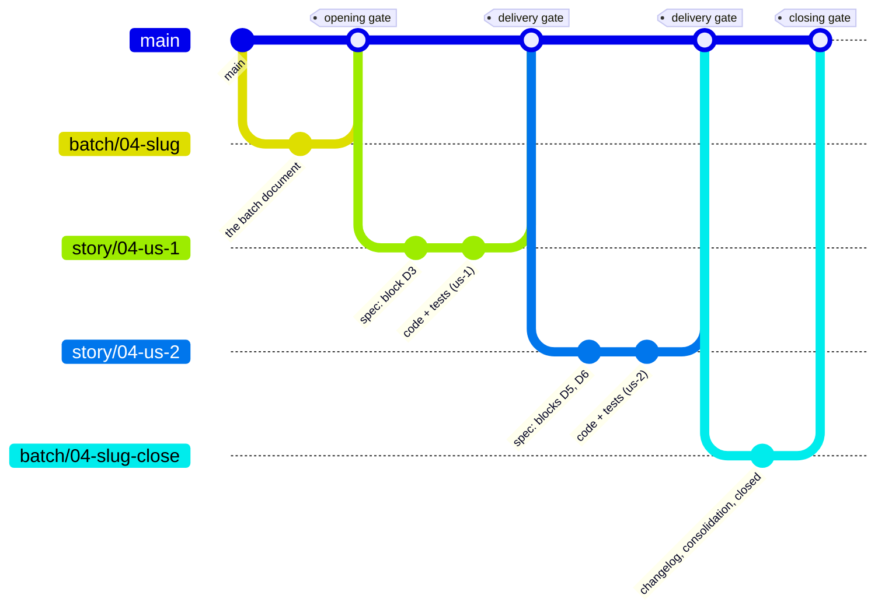
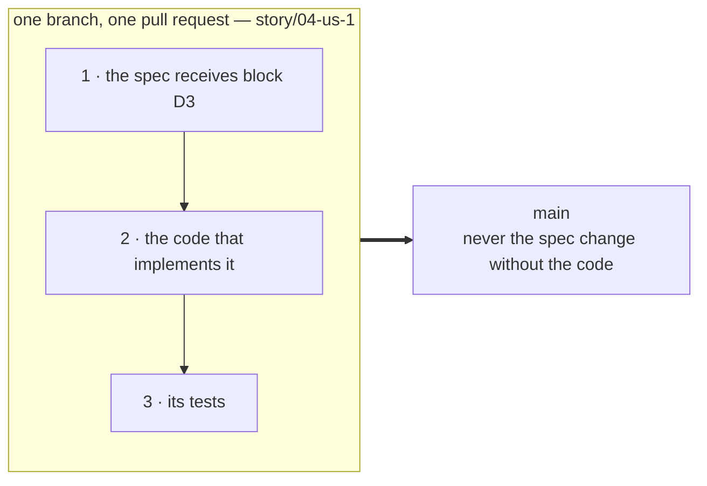

# supercharlouze

superpowers writes one dated design document per feature, and one plan per
feature. Nothing accumulates: after ten features, a module's behaviour lives in
ten snapshots, and none of them describes what the code does today.

This plugin replaces that tail of the flow, and only that tail.

| superpowers | supercharlouze |
|---|---|
| one dated design document per feature | one living spec per module |
| one plan per feature | a batch of user stories, one plan each |
| a snapshot of what was intended then | the binding authority of every review, now |

Brainstorming, TDD, subagent-driven development, systematic debugging and code
review are reused unchanged. The flow departs from superpowers in exactly four
places, and each one is declared.

## Install

```bash
/plugin marketplace add charlouze/superpowers-by-charlouze
/plugin install supercharlouze@supercharlouze
```

Then run `/supercharlouze:init` in each project you want to move over. It opens
a pull request installing the routing block in the project's `CLAUDE.md`.

Nothing is adopted by that. A module without a spec has no authority to review
against, so adopting one is a step of its own, with its own pull request — and
you take them one at a time, when a batch first needs them.

## How it works

What follows is a reading guide, deliberately lighter than the real thing. This
plugin eats its own cooking: its living spec is `docs/specs/supercharlouze.md`,
and that document — not this one — is the authority.

### The model

- **Module** — a coarse functional domain, seen from the outside. A human draws
  the boundaries; they are never inferred.
- **Spec** — one living document per module, at `docs/specs/<module>.md`.
  Undated, normative, binding. It carries business rules and intentions; the
  mechanism stays in the code.
- **Gaps register** — `docs/specs/<module>.gaps.md`, the home of what a spec may
  not carry: code that contradicts it, and behaviour no spec describes.
- **Batch** — the delivery unit, at `docs/batches/NN-<slug>/`. It groups stories
  and exists to make specs grow. Its document carries, in blocks, the exact text
  those specs will receive.
- **User story** — one implementation plan, one module, one branch, one pull
  request.
- **Feature flag** — what lets a story ship alone without exposing a half-built
  batch. It is a specified object, not an implementation detail: the spec states
  its name and its default.

### The life of a batch



Every human gate is a pull request review. The plugin adds no ceremony of its
own; it puts its checkpoints where your flow already has them.

| Gate | What you are reviewing |
|---|---|
| Module adoption | the spec and the gaps register, before any batch touches that module |
| Batch opening | the exact text each spec will receive, before a line of code is written against it |
| Story delivery | a story's code, and its spec change if it has one, in one diff |
| Batch amendment | a change of scope or of flag on an open batch |
| Batch closing | the changelog, the consolidation, `status: closed` |

The opening gate is the one that pays. You read the wording of a spec at the
moment changing it still costs nothing — and no story may be written until it
merges.

### The anatomy of a story



**The spec change is the first commit of the branch**, before the plan is
written and before any task runs. Not for visibility — the file would be
readable in the worktree either way — but because this is what makes the norm
*prior and opposable* to the code: it is already in the branch's history when
implementation starts. A story that transcribes no block has no spec change
to put first; its first commit carries the story document's header instead,
and fixes its scope the same way.

**The pull request never carries the spec change without the code.** That is
what gives `main` its central property: its spec always describes exactly
what its code does. There is no intermediate state, therefore no marker to
invent and no exception to the drift rule — any divergence between the spec
on `main` and the code on `main` is drift, and drift is corrective work.

Between that first commit and the opening of the pull request, the spec file is
**frozen**: a task discovering that the spec must change stops instead, because
correcting a spec is a human act. The freeze lifts when the pull request opens —
an unbounded one would make answering a review impossible.

### Why everything lands on `main`

Two project constraints, not choices of this plugin: `main` is protected, so
everything goes through a pull request, and `main` is deployed continuously, so
every merge ships. Feature flags exist because of the second one.

The two natural alternatives are ruled out, and the reasons are worth stating:

- a **batch branch** creates a blind spot. Concurrency detection has exactly two
  sources — the open pull requests and the pushed `story/*` branches — and a
  story merged into a batch branch leaves both at once. The sections it holds
  become invisible to its siblings for the rest of the batch, which is precisely
  the stretch a batch branch is supposed to protect.
- a **`develop` branch** creates two baselines for the drift rule: the reference
  spec on `develop`, the running code on `main`. A corrective batch then no
  longer knows what it is correcting against.

A flag protects production without holding code back, so it creates neither. It
is expected to be short-lived: one that outlives its batch must declare its scope
and the condition that lifts it, and a batch cannot be closed while a flag it
declared survives by accident.

### Two stories at once

Several stories are in flight simultaneously — the normal regime of a pull
request flow, not an edge case. A conflict is two stories touching **the same
section of the same spec**; the section is the unit everything is counted in.

Detection is by **declaration**, never by diff. Each story document lists the
sections it touches, and a starting story reads those declarations from the open
pull requests *and* from every pushed `story/*` branch that carries no pull
request yet. Both sources are needed: a story's pull request opens only at the
very end, so for the whole length of an implementation its pushed branch is the
only thing showing what it holds.

Git is a partial net here, not the net. It conflicts on lines, not on sections,
so two edits far apart inside one section merge cleanly — exactly the case worth
catching.

### What stays outside a batch

The spike / bounded / architectural classification of superpowers is kept as it
is. A spike is an answer, and leaves no artifact. A **bounded change** — a
well-scoped change to code that already exists — keeps its own ceremony and its
`fix/<slug>` branch, under four rules: it updates the spec in the same pull
request, so no change leaves the spec silent; it declares its sections like a
story; it carries no flag, being complete on its own; and it may write to a gaps
register directly. Only architectural work opens a batch.

### The four departures

Everywhere else, superpowers applies unchanged. The flow departs in exactly four
places, each declared rather than improvised:

1. **No dated design document.** An architectural design ends by opening a batch;
   the plan is written with each story, not before.
2. **A corrective batch has one more stop condition.** If the code turns out to
   be right and the spec wrong, the batch is no longer corrective and must be
   requalified. An agent may not correct a spec.
3. **The execution mode is imposed** — subagent-driven development, because
   repatriating its rulings depends on its ledger, and those rulings are the only
   record of where the spec was ambiguous.
4. **A story ends in a pull request.** Neither a local merge nor a kept branch is
   offered: the first is destructive, the second leads nowhere.

There is never an undeclared fifth one.

## Skills

| Skill | Use it when |
|---|---|
| `supercharlouze:using-batches` | Entry point — routing, authority rules, declared overrides |
| `supercharlouze:adopting-a-module` | A module has no living spec yet |
| `supercharlouze:writing-a-batch` | Opening, amending or requalifying a batch |
| `supercharlouze:writing-a-user-story` | Writing the next story of an open batch |
| `supercharlouze:closing-a-batch` | Every story is merged or abandoned |

## Requirements

- Claude Code — the only supported harness
- superpowers installed
- `gh`, installed and authenticated — number allocation and concurrency detection
  query it; without it they fall back to a partial net and no longer prevent
  anything

Projects organised as git submodules are not supported.

**Strongly recommended: give the agent a git identity of its own.** Every gate of
this flow is a pull request review, and GitHub does not let the author of a pull
request approve it. So if the agent commits and opens pull requests under your
account, you are reviewing yourself: the approval is unavailable to you, and a
branch protection requiring one cannot be satisfied. A GitHub App or a machine
account settles it — the agent proposes, you review and approve, and the
conversation on a pull request has two voices instead of one. The plugin neither
sets this up nor depends on it.

## Contributing

`CONTRIBUTING.md` covers the test suite and what it deliberately leaves
untested, the checks every pull request runs, and how releases are cut.

## License

MIT
