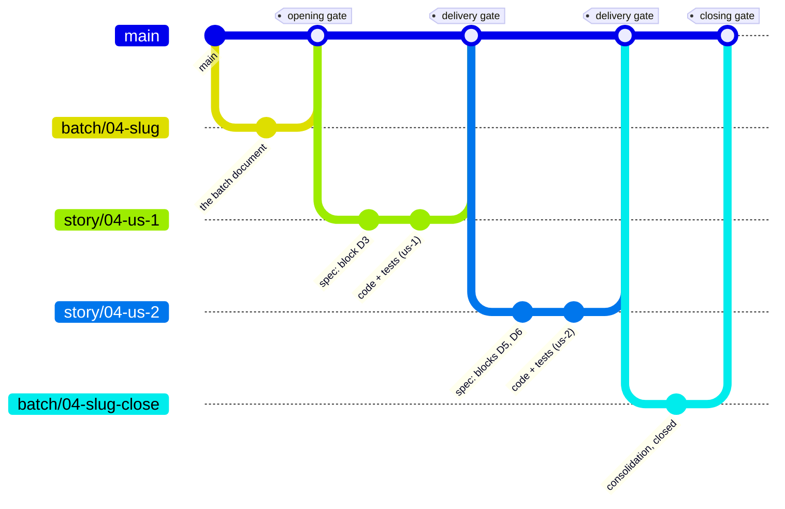
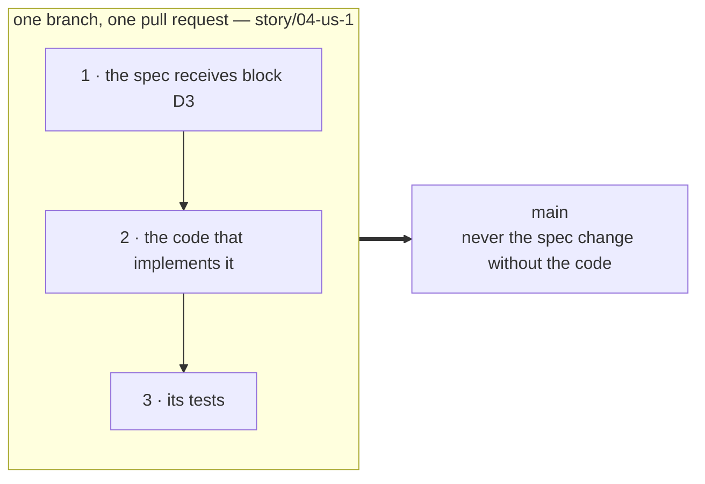

# supercharlouze

superpowers writes one dated design document per feature, and one plan per
feature. Nothing accumulates: after ten features, a module's behaviour lives in
ten snapshots, and none of them describes what the code does today.

This plugin replaces that tail of the flow, and only that tail.

| superpowers | supercharlouze |
|---|---|
| one dated design document per feature | one living spec per module |
| one plan per feature | a batch of user stories, one plan each |
| a snapshot of what was intended then | the binding authority of every review, now |

Brainstorming, TDD, subagent-driven development, systematic debugging and code
review are reused unchanged. The flow departs from superpowers in exactly four
places, and each one is declared.

## Install

```bash
/plugin marketplace add charlouze/superpowers-by-charlouze
/plugin install supercharlouze@supercharlouze
```

Then run `/supercharlouze:init` in each project you want to move over. It opens
a pull request installing the routing block in the project's `CLAUDE.md`.

Nothing is adopted by that. A module without a spec has no authority to review
against, so adopting one is a step of its own, with its own pull request — and
you take them one at a time, when a batch first needs them.

## How it works

What follows is a reading guide, deliberately lighter than the real thing. This
plugin eats its own cooking: its living spec is `docs/specs/supercharlouze.md`,
and that document — not this one — is the authority.

### The model

- **Module** — a coarse functional domain, seen from the outside. A human draws
  the boundaries; they are never inferred.
- **Spec** — one living document per module, at `docs/specs/<module>.md`.
  Undated, normative, binding. It carries business rules and intentions; the
  mechanism stays in the code.
- **Gaps register** — `docs/specs/<module>.gaps.md`, the home of what a spec may
  not carry: code that contradicts it, and behaviour no spec describes.
- **Batch** — the delivery unit, at `docs/batches/NN-<slug>/`. It groups stories
  and targets one or more modules, hence one or more specs. Its document carries,
  in blocks, the exact text those specs will receive.
- **User story** — one implementation plan, one module, one branch, one pull
  request.
- **Technical story** — a story that changes nothing observable at its module's
  boundary: a dependency bump, an internal rename, a preparatory refactor. It
  declares the qualification, and a stop condition catches it if it is false.
- **ADR** — the document that records a technical decision of the project and
  its reason, at `docs/adr/<slug>.md`. A decision earns one only if undoing it
  is expensive, it surprises whoever does not know its context, and it settles
  between real alternatives. A human decides every one.
- **Feature flag** — what lets a story ship alone without exposing a half-built
  batch. It is a specified object, not an implementation detail: the spec states
  its name and its default.

### The life of a batch


```mermaid
gitGraph
   commit id: "main"
   branch batch/04-slug
   commit id: "the batch document"
   checkout main
   merge batch/04-slug tag: "opening gate"
   branch story/04-us-1
   commit id: "spec: block D3"
   commit id: "code + tests (us-1)"
   checkout main
   merge story/04-us-1 tag: "delivery gate"
   branch story/04-us-2
   commit id: "spec: blocks D5, D6"
   commit id: "code + tests (us-2)"
   checkout main
   merge story/04-us-2 tag: "delivery gate"
   branch batch/04-slug-close
   commit id: "consolidation, closed"
   checkout main
   merge batch/04-slug-close tag: "closing gate"
```

Every human gate is a pull request review. The plugin adds no ceremony of its
own; it puts its checkpoints where your flow already has them.

| Gate | What you are reviewing |
|---|---|
| Module adoption | the spec and the gaps register, and the ADRs written with them, before any batch touches that module |
| Batch opening | the exact text each spec will receive, before a line of code is written against it, and the ADRs written, rewritten or deleted with it |
| Story delivery | a story's code, its spec change if it has one, and the ADRs the review asks for, in one diff |
| Batch amendment | a change of scope, of spec delta, of technical design, of constraints or of flag on an open batch, and the ADRs written, rewritten or deleted with it |
| Batch closing | the consolidation, `status: closed` |

The opening gate is the one that pays. You read the wording of a spec at the
moment changing it still costs nothing — and no story may be written until it
merges.

### The anatomy of a story


```mermaid
flowchart LR
    subgraph PR["one branch, one pull request — story/04-us-1"]
        direction TB
        C1["1 · the spec receives block D3"]
        C2["2 · the code that implements it"]
        C3["3 · its tests"]
        C1 --> C2 --> C3
    end
    PR ==> M["main<br/>never the spec change without the code"]
```

**The spec change is the first commit of the branch**, before the plan is
written and before any task runs. Not for visibility — the file would be
readable in the worktree either way — but because this is what makes the norm
*prior and opposable* to the code: it is already in the branch's history when
implementation starts. A story that transcribes no block has no spec change
to put first; its first commit carries the story document's header instead,
and fixes its scope the same way.

**The pull request never carries the spec change without the code.** That is
what gives `main` its central property: its spec always describes exactly
what its code does. There is no intermediate state, therefore no marker to
invent and no exception to the drift rule — any code on `main` that contradicts
the spec on `main`, and any behaviour on `main` that no spec describes, is drift,
and drift is corrective work.

Between that first commit and the opening of the pull request, the spec file is
**frozen**: a task discovering that the spec must change stops instead, because
correcting a spec is a human act. The freeze lifts when the pull request opens —
an unbounded one would make answering a review impossible.

### Why everything lands on `main`

Two project constraints, not choices of this plugin: `main` is protected, so
everything goes through a pull request, and everything that reaches `main` may
ship to production, which is why feature flags exist.

The two natural alternatives are ruled out, and the reasons are worth stating:

- a **batch branch** creates a blind spot. Concurrency detection reads only the
  open pull requests and the pushed `story/*` and `bounded/*` branches, and a
  story merged into a batch branch leaves both at once. The sections it holds
  become invisible to its siblings for the rest of the batch, which is precisely
  the stretch a batch branch is supposed to protect.
- a **`develop` branch** creates two baselines for the drift rule: the reference
  spec on `develop`, the running code on `main`. A corrective batch then no
  longer knows what it is correcting against.

A flag protects production without holding code back, so it creates neither. It
is expected to be short-lived: one that outlives its batch must declare its scope
and the condition that lifts it, and a batch cannot be closed while a flag it
declared survives by accident.

### Two stories at once

Several stories are in flight simultaneously — the normal regime of a pull
request flow, not an edge case. A conflict is two stories touching **the same
section of the same spec**; the section is the unit everything is counted in.

A conflict is also a story and a bounded change touching the same section.
Detection is by declaration. Each story document lists the spec it targets and
the sections it touches, and a bounded change lists them in its pull request
body. A starting story reads those declarations from the open pull requests
whose branch is `story/*` or `bounded/*`, and from every pushed `story/*` or
`bounded/*` branch that carries no pull request yet. A pushed branch that has
not declared yet is read by the sections it has already changed. The branch
name is the filter: only those branches claim sections, so a pull request that touches no spec at all is seen like any other.

Git is a partial net here, not the net. It conflicts on lines, not on sections,
so two edits far apart inside one section merge cleanly — exactly the case worth
catching.

### What stays outside a batch

The spike / bounded / architectural classification of superpowers is kept as it
is. A spike is an answer, and leaves no artifact. A **bounded change** — a
well-scoped change to code that already exists — keeps its own ceremony and its
`bounded/<slug>` branch, under these rules: it updates the spec in the same pull
request whenever something observable at the module's boundary changes, and says
nothing there only when nothing does; it carries, without touching the code, the
correction of a spec the human judges wrong where the code is right; it declares
the spec it targets and the sections it touches, like a story; it carries no
flag, being complete on its own; it may write to a gaps register directly; it
may write, rewrite and delete ADRs, or carry nothing but ADRs; it holds the ADRs
`main` carries when its branch starts, and puts to the human one it cannot hold;
and it puts to the human the technical decision it takes that would earn an ADR.
Only architectural work opens a batch.

### The four departures

Everywhere else, superpowers applies unchanged. The flow departs in exactly four
places, each declared rather than improvised:

1. **No dated design document.** An architectural design ends by opening a batch;
   the plan is written with each story, not before.
2. **The flow adds stop conditions.** If the code turns out to be right and the
   spec wrong, a corrective batch is no longer corrective and must be
   requalified. If a story declared technical turns out to change something
   observable at its module's boundary, it is no longer technical. If a story
   finds that a constraint of its batch or an ADR cannot be held, it stops and
   puts it to the human. An agent may neither correct a spec, nor keep a
   qualification it has lost, nor bend a constraint or an ADR.
3. **The execution mode is imposed** — subagent-driven development, because
   repatriating its rulings depends on its ledger, and those rulings are the only
   record of where the spec was ambiguous.
4. **A story ends in a pull request.** Neither a local merge nor a kept branch is
   offered: the first is destructive, the second leads nowhere.

There is never an undeclared fifth one.

## Skills

| Skill | Use it when |
|---|---|
| `supercharlouze:using-batches` | Entry point — routing, declared overrides |
| `supercharlouze:following-the-rules` | Never directly — the rules that hold at every moment of the flow, which the other skills and a story's plan invoke |
| `supercharlouze:adopting-a-module` | A module has no living spec yet |
| `supercharlouze:opening-a-batch` | Opening a batch |
| `supercharlouze:amending-a-batch` | Amending an open batch |
| `supercharlouze:handling-a-stopped-story` | A story has stopped on a stop condition the flow adds |
| `supercharlouze:delivering-a-story` | Writing the next story of an open batch |
| `supercharlouze:closing-a-batch` | Every story is merged or abandoned |
| `supercharlouze:making-a-bounded-change` | A well-scoped change that needs no batch, a spec the human judges wrong where the code is right, or an ADR to write, rewrite or delete outside a batch |
| `supercharlouze:rereading-a-spec` | Never directly — a building block the other skills invoke to have a spec reread |
| `supercharlouze:rereading-a-technical-design` | Never directly — a building block the other skills invoke to have a batch's technical design, its blocks and its ADRs reread |
| `supercharlouze:recording-a-decision` | Never directly — a building block the other skills invoke to have an ADR written or rewritten |
| `supercharlouze:writing-in-a-spec` | Never directly — a building block the other skills invoke before writing into a spec |
| `supercharlouze:writing-in-a-gaps-register` | Never directly — a building block the other skills invoke before writing into a gaps register |
| `supercharlouze:detecting-concurrency` | Never directly — a building block the other skills invoke to check that nobody else holds the sections a piece of work will touch |
| `supercharlouze:abandoning-a-story` | Never directly — a building block the other skills invoke to close an abandoned story's pull request, delete its branch and remove its worktree |
| `supercharlouze:applying-a-spec-delta` | Never directly — a building block the other skills invoke to build, outside the repository, a copy of each spec with a batch's blocks applied |
| `supercharlouze:running-reread-rounds` | Never directly — a building block the other skills invoke to run the rounds of a reread: gather the readers' findings, work them through and open the later rounds |
| `supercharlouze:starting-a-branch` | Never directly — a building block the other skills invoke to start a branch from `main` as the remote carries it: fetch, create the branch and its workspace, restore its name and its starting point |
| `supercharlouze:finishing-a-pr` | Never directly — a building block the other skills invoke to end a pull request's review: its corrections, the squash, the announcement that it is ready, then the clear context its merge calls for |
| `supercharlouze:writing-a-batch-document` | Never directly — a building block the other skills invoke to give a batch document its form: its fields, its blocks and its flag decision |
| `supercharlouze:rereading-a-batch` | Never directly — a building block the other skills invoke to conduct the rereads a batch owes before its pull request opens: coherence, technical, then batch document |

## Requirements

- Claude Code — the only supported harness
- superpowers installed
- `gh`, installed and authenticated — number allocation and concurrency detection
  query it; without it they fall back to a partial net and no longer prevent
  anything

Projects organised as git submodules are not supported.

**Recommended: the `domain-driven-design`, `clean-architecture` and
`software-design-philosophy` skills.** The rereads use them when they are
installed, and read without them otherwise.

**Strongly recommended: give the agent a git identity of its own.** Every gate of
this flow is a pull request review, and GitHub does not let the author of a pull
request approve it. So if the agent commits and opens pull requests under your
account, you are reviewing yourself: the approval is unavailable to you, and a
branch protection requiring one cannot be satisfied. A GitHub App or a machine
account settles it — the agent proposes, you review and approve, and the
conversation on a pull request has two voices instead of one. The plugin neither
sets this up nor depends on it.

## Contributing

`CONTRIBUTING.md` covers the test suite and what it deliberately leaves
untested, the checks every pull request runs, and how releases are cut.

## License

MIT
