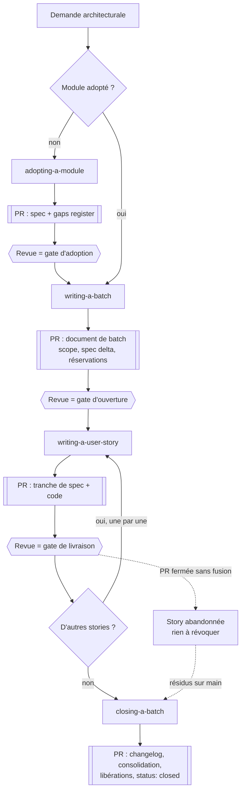
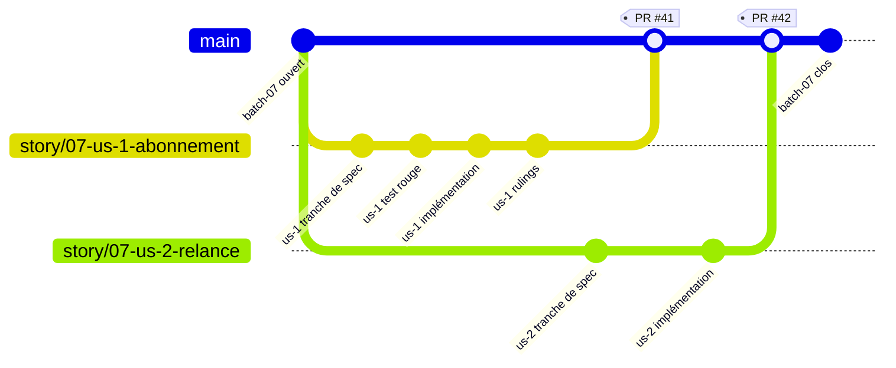
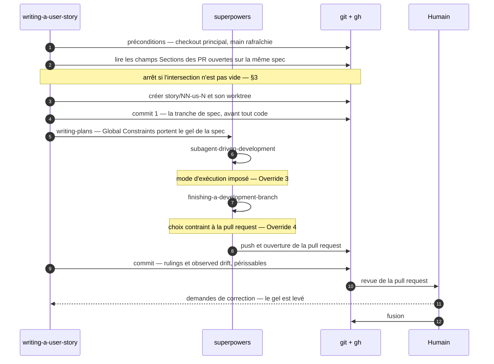
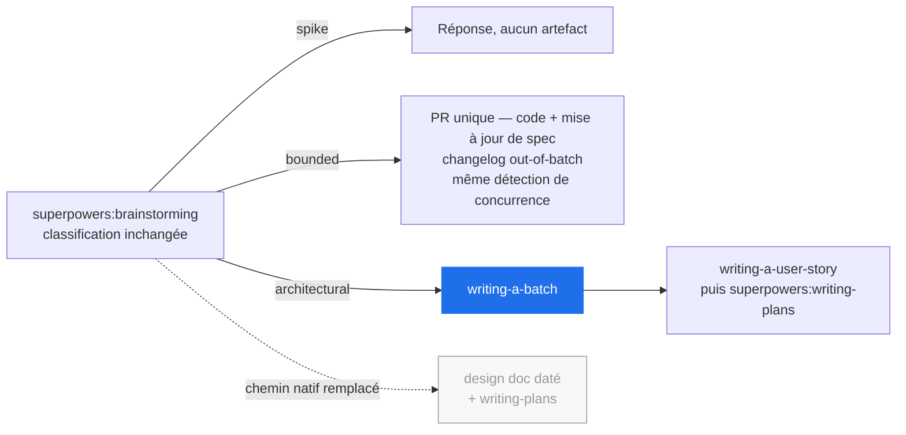

# supercharlouze — Design

**Goal:** un plugin Claude Code qui surcharge l'organisation des specs et des
plans de superpowers. Il remplace les documents de conception datés et jetables
par une spécification vivante par module fonctionnel, et remplace les plans
isolés par des *batches* de user stories qui font grandir ces specs.

**Status:** conception validée le 2026-09-03, révisée après quatre relectures
adversariales. Rien n'est encore implémenté.

**Plugin name:** `supercharlouze` (namespace de tous les skills). Dépôt :
`superpowers-by-charlouze`.

**Target harness:** Claude Code uniquement.

---

## 1. Problem

superpowers écrit un document de conception daté par fonctionnalité
(`docs/superpowers/specs/YYYY-MM-DD-<topic>-design.md`) et un plan par
fonctionnalité (`docs/superpowers/plans/YYYY-MM-DD-<feature-name>.md`). Les
deux sont des instantanés d'une intention à un moment donné, et aucun n'est
jamais repris.

Rien ne capitalise. Au bout de dix fonctionnalités, le comportement d'un module
est éparpillé dans dix documents qui décrivent chacun un delta et dont aucun ne
décrit l'état courant. Aucun artefact ne répond à la question « que fait le
module facturation aujourd'hui ? » — et par conséquent aucun artefact ne peut
révéler que le code a dérivé de ce qui avait été validé.

## 2. Model

**Module** — un domaine fonctionnel grossier, vu de l'extérieur. Les modules
sont délimités par l'humain, jamais déduits par un agent. Préférer peu de gros
modules à beaucoup de petits : un projet à trois modules est normal, un projet
à quinze est une erreur de découpage. Ce plugin entier constitue un seul
module.

**Spec** — un document vivant par module, dans `docs/specs/<module>.md`. Elle
est **normative** (ce que le code doit faire), pas descriptive (ce que le code
fait par accident). Elle ne porte pas de date. Elle est l'autorité contraignante
de toutes les revues.

**Section** — la plus petite unité titrée d'une spec. C'est l'unité de tout ce
qui se compte dans ce système : un conflit de concurrence se juge sur une
section, une entrée de gaps register désigne une section. Le mot « exigence »
n'est pas employé comme unité, faute de pouvoir en définir la granularité.

**Batch** (« lot ») — l'unité de livraison, dans `docs/batches/NN-<slug>/`. Un
batch regroupe plusieurs user stories. Sa raison d'être est d'ajouter des
fonctionnalités à une ou plusieurs specs. Un batch peut être transverse à
plusieurs modules.

**User story** — un plan d'implémentation, dans
`docs/batches/NN-<slug>/NN-us-N-<slug>.md`. Elle appartient à exactement un
batch et vise exactement **un** module, donc une seule spec. C'est aussi l'unité
de livraison technique : **une story, une branche, une pull request** — et cette
pull request porte *à la fois* la tranche de spec et le code qui la réalise
(§5.1).

**Corrective batch** — un batch dont le spec delta est vide. Son but est de
remettre le code existant en conformité avec une spec déjà vraie. Son périmètre
est puisé dans le gaps register d'un module.

## 3. Authority and conflict rules

La spec est l'autorité contraignante. Le batch ne porte que ce qu'une spec ne
peut pas porter : le périmètre de livraison, l'ordre des user stories, les
contraintes de migration et de compatibilité, et la raison pour laquelle ce
travail a lieu maintenant.

**Quand un batch et une spec se contredisent, la spec gagne — sans exception et
sans délibération.** L'agent implémente ce que dit la spec, inscrit un
`Ruling:`, et poursuit. **Corriger une spec en cours de batch est un acte
humain, jamais un acte d'agent.**

**Corollaire opérationnel — le gel du fichier de spec, et sa borne.** Parce que
la tranche de spec et le code voyagent dans la même branche (§5.1), le fichier
de spec est physiquement éditable par les tâches de SDD, ce qu'il n'était pas
quand il vivait ailleurs. La règle est donc portée au niveau du fichier, **avec
un début et une fin** :

> Entre le commit de transcription et l'ouverture de la pull request, aucune
> tâche ne modifie le fichier de spec. Une story qui découvre que la spec doit
> changer s'arrête.

Après l'ouverture de la pull request, le gel est levé : les demandes de la revue
sont des décisions humaines, y compris sur la formulation de la tranche de spec,
et elles s'appliquent sur la branche de la story (§5.3). Un gel sans borne
rendrait littéralement impossible de répondre à une revue — ou de résoudre un
conflit de fusion portant sur le fichier de spec.

Cette règle est recopiée dans la section `Global Constraints` de chaque plan
(§4.4), donc sous les yeux de chaque implémenteur et de chaque reviewer.

**Tout conflit est consigné pour l'humain.** On réutilise le mécanisme existant
plutôt que d'en inventer un : `superpowers:subagent-driven-development` tient un
ledger dont les décisions prennent la forme
`Ruling: <décision> — <pourquoi> — <ce que ça coûte si c'est faux>`, et les
présente sous le titre « Rulings I made » avant de supprimer son workspace. Ces
rulings sont recopiés dans le document de story, sur la branche de la story,
avant que la pull request soit fusionnée — donc dans la session où ils existent
encore.

**Concurrence.** Deux stories qui touchent la même section d'une même spec sont
un conflit. **La détection est celle du §5.3 : chaque document de story déclare
les sections qu'elle touche, et une story qui démarre les compare à celles des
pull requests ouvertes.** Le conflit de fusion git n'est qu'un filet **partiel**
— git conflicte sur des lignes, pas sur des sections, donc deux stories
modifiant la même section à des endroits éloignés fusionnent proprement. Compter
sur lui reviendrait à laisser passer exactement le cas qu'on veut attraper.

## 4. Artifact layout

```
docs/
  specs/
    facturation.md                spec vivante, une par module, non datée
    facturation.gaps.md           gaps register du module
  batches/
    07-facturation-recurrente/
      README.md                   le batch
      07-us-1-abonnement.md       une user story = un plan superpowers
      07-us-2-relance.md
  archive/
    specs/                        anciens docs/superpowers/specs/
    plans/                        anciens docs/superpowers/plans/
```

Les *patrons* de chemins sont anglais et figés ; les *slugs* suivent la langue
du projet, puisqu'ils nomment des objets métier (§10).

**Attribution des numéros.** `NN` (batch) et `us-N` (story) suivent la même
règle : le plus petit entier non utilisé **dans `docs/batches/` sur `main`** et
**non revendiqué par une pull request ouverte** (`gh pr list`). Les deux
conditions sont nécessaires, et pour la même raison dans les deux cas : un
artefact n'atteint `main` qu'à la fusion de sa pull request, donc le contenu du
répertoire ignore tout ce qui est en vol. Se fier au seul contenu de `main`
ferait prendre le même numéro à deux batches ouverts en parallèle, ou à deux
stories écrites pendant qu'une troisième est en revue.

**Le préfixe `NN-` des fichiers de story** garantit l'unicité des basenames.
Sur le chemin nominal il est confortable plutôt que nécessaire : chaque story
s'exécute dans son propre worktree, et `sdd-workspace` résout son répertoire via
`git rev-parse --show-toplevel`, donc deux stories ont des workspaces
physiquement disjoints. Il devient nécessaire sur les chemins dégradés — worktree
refusé par l'humain, isolation indisponible — où deux stories partageraient un
checkout : `sdd-workspace` dérive alors le workspace du **basename** du plan, et
deux `us-1-setup.md` partageraient `progress.md`. SDD détecterait un ledger
étranger, mais sa consigne — le laisser en place et en démarrer un autre — est
inapplicable au même chemin.

**Nommage des branches**, appliqué par le plugin et non par superpowers :

| Type de pull request | Branche |
|---|---|
| Story | `story/NN-us-N-<slug>` |
| Ouverture de batch | `batch/NN-<slug>` |
| Clôture de batch | `batch/NN-<slug>-close` |
| Adoption d'un module | `adopt/<module>` |
| `init` | `chore/supercharlouze-init` |
| Bounded (§8.2) | `fix/<slug>` |

Ce nommage est une convention que le plugin **fait respecter lui-même** (§5.1),
pas une propriété de `superpowers:using-git-worktrees` : ce skill préfère les
outils natifs du harness, qui choisissent le nom de branche, et peut aboutir à
un HEAD détaché dont la branche ne sera nommée qu'au moment de la finition.
Aucun mécanisme de ce document ne dépend du nom de branche — l'identification
passe par la pull request et par le document de story.

### 4.1 Spec document

Décrit le comportement. Ni date, ni statut, ni marqueur — **rien qui signale un
travail en cours**. C'est une propriété du modèle git et non une préférence de
style : sur `main`, la spec et le code avancent ensemble, dans la même pull
request (§5.1), donc il n'existe jamais d'état où la spec décrirait quelque
chose que le code ne fait pas encore.

- Une table **Changelog** en pied de document porte l'historique :
  `batch | date | change`. **Une ligne par batch, écrite par `closing-a-batch`**
  (§5.4) — pas une ligne par story. Le changelog est de granularité batch par
  nature ; le faire écrire par chaque story ferait conflicter au même point
  toutes les stories d'un même module en vol simultanément, ce qui est le
  régime nominal. Les modifications faites hors de tout batch (§8.2) portent
  `out-of-batch` et sont écrites par leur propre pull request.
- Une section **Sources** liste les documents validés consommés lors de
  l'adoption (§6), par leur chemin **après archivage** (`docs/archive/...`).
  Elle est ce qui rend calculable l'état des lieux de `init` (§9).

Le changelog est un confort de lecture, pas un mécanisme : aucune règle de ce
document n'en dépend. L'historique faisant autorité est celui du fichier lui-même
(`git log docs/specs/<module>.md`), et il est exact par construction puisque
chaque changement de spec voyage avec son code.

**La règle de dérive s'énonce alors sans exception :** *toute divergence entre
la spec de `main` et le code de `main` est une dérive*, donc du travail
correctif. Il n'y a pas de cas « pas encore livré » à excepter, parce que ce cas
n'existe pas.

### 4.2 Gaps register

`docs/specs/<module>.gaps.md` est un document vivant, pas un rapport jetable.
Deux sections distinctes, parce qu'elles ne se traitent pas pareil :

- **Violations** — le code contredit la spec. Alimente un *corrective batch*.
- **Gaps** — le code fait des choses qu'aucune spec ne décrit. Alimente un
  batch ordinaire qui les spécifie enfin.

**Qui écrit dedans — deux écrivains seulement.** `adopting-a-module` le crée
(§6.4). Ensuite, **`closing-a-batch`** y consolide, en une seule pull request,
les dérives que les stories du batch ont constatées hors périmètre. Les stories
elles-mêmes **n'écrivent pas dans le registre** : elles consignent leurs
constats dans leur propre document, sous **Observed drift**. Faire écrire chaque
story dans le registre y recréerait exactement la contention que le changelog
vient d'éviter.

Un bounded (§8.2), qui n'appartient à aucun batch, écrit directement dans le
registre : il est seul et ne concurrence personne d'autre qu'un autre bounded.

**Réservation, consommation, libération.** Chaque entrée désigne une section de
la spec.

- **Réservée** par la pull request d'ouverture du batch qui la prend en charge
  (annotation `reserved by batch-08`).
- **Barrée** par la pull request de la story qui la résorbe, atomiquement avec
  le code qui la résorbe.
- **Libérée** par `closing-a-batch` si elle n'a pas été consommée — story
  abandonnée, périmètre revu. Sans cette étape, une story abandonnée laisserait
  sur `main` une réservation perpétuelle qui empêcherait tout autre batch de
  reprendre l'écart : la réservation vit sur `main`, fermer la pull request de
  la story ne l'emporte pas.

Le registre déclare aussi **sa propre couverture** : quelles parties du module
ont été auditées, lesquelles ne l'ont pas été, et pourquoi. Un registre vide qui
signifie « rien n'a été examiné » ne doit pas ressembler à un registre vide qui
signifie « tout est conforme ».

### 4.3 Batch document

Un `README.md` avec un front matter `status: open | closed`, et :

- **Scope** — ce que ce batch livre, et pourquoi maintenant.
- **Spec delta** — le comportement ajouté à chaque spec, énoncé comme
  intention. Ce delta n'est transcrit dans aucune spec à l'ouverture : il l'est
  tranche par tranche, par la pull request de chaque story (§5.3). Pour un
  corrective batch, ce champ est vide et remplacé par les entrées du gaps
  register que le batch réserve.

**Le document de batch ne porte aucun état mutable**, et c'est délibéré : il est
écrit une fois par sa pull request d'ouverture, puis ne bouge plus jusqu'à sa
clôture. Deux conséquences.

- **La liste des stories n'y figure pas** : elle est le contenu du répertoire du
  batch, complété par les pull requests ouvertes. Une liste maintenue à la main
  serait modifiée par chaque story et produirait un conflit de fusion à chaque
  fois, pour aucune information que le système ne possède déjà.
- **L'état d'une story n'y figure pas non plus** : l'état d'une story *est*
  l'état de sa pull request. Cocher une case reviendrait à recopier une vérité
  que `gh pr list` donne mieux, et à la désynchroniser dès la première pull
  request fusionnée hors session.

### 4.4 User story document

Un plan superpowers standard, produit par `superpowers:writing-plans`,
enregistré dans le répertoire du batch, avec un header étendu :

```markdown
**Spec:** docs/specs/facturation.md
**Batch:** docs/batches/07-facturation-recurrente/README.md
**Sections:** Abonnement > Renouvellement, Abonnement > Proration
```

`Spec:` est le champ que `subagent-driven-development` lit déjà comme autorité
contraignante — le faire pointer vers la spec vivante du module est ce qui fait
fonctionner l'intégration sans modifier superpowers.

`Sections:` **est le mécanisme de détection de concurrence** (§3, §5.3). Il est
déclaré et non déduit : lire un diff pour deviner quelles sections une story
touche est fragile, alors que l'auteur de la story le sait.

Le document porte en outre un **Rulings log** et une section **Observed drift**,
remplis avant la fusion (§3, §4.2).

**Ce montage n'est correct qu'à trois conditions**, toutes load-bearing :

1. **La transcription est incrémentale** — une tranche par story, jamais le
   delta complet du batch. Sinon la spec décrirait, pendant l'exécution de la
   story 1, le comportement des stories suivantes, et les reviewers de SDD
   signaleraient comme manquant ce qui n'est pas encore livré.
2. **La transcription est le premier commit de la branche**, avant que le plan
   soit écrit et que la moindre tâche s'exécute. Pas pour une raison de
   visibilité — le fichier serait lisible dans le worktree même non commité —
   mais parce que c'est ce qui rend la norme **antérieure et opposable** au
   code : elle est déjà dans l'histoire de la branche quand l'implémentation
   commence, elle voyage dans la pull request, et le gel du §3 a un point de
   départ identifiable.
3. **La branche part d'un `main` à jour, depuis le checkout principal** (§5.1).

`Global Constraints` — que `superpowers:writing-plans` définit comme faisant
implicitement partie des exigences de chaque tâche — porte deux choses : les
contraintes que le batch impose, recopiées mot pour mot, et **le gel du fichier
de spec** (§3).

## 5. Batch lifecycle

Vue d'ensemble. Les losanges hexagonaux sont les **gates humains**, et chacun est
une revue de pull request — le plugin n'en ajoute aucun ailleurs.



L'arête pointillée est le seul chemin non nominal : une story abandonnée ne
laisse rien dans la spec, mais laisse sur `main` sa réservation au gaps register
et l'intention annoncée par le batch — que la clôture doit constater (§5.4).

### 5.1 Git model

`main` est protégée : **tout passe par une pull request.** Le modèle en découle
entièrement, et cette contrainte est un atout plutôt qu'une gêne.

**Une pull request de story porte la tranche de spec et le code qui la
réalise.** Ils sont livrés ensemble ou pas du tout. C'est ce qui donne à `main`
sa propriété centrale : **sa spec décrit toujours exactement ce que son code
fait.** Aucun état intermédiaire à signaler, donc aucun marqueur, aucune
sémantique à faire comprendre à des agents qui ignorent ce plugin, et aucune
exception à la règle de dérive.



Ce graphe porte l'invariant central : **la tranche de spec est le premier commit
de chaque branche**, et elle rejoint `main` par la même fusion que son code. À
aucun instant `main` ne connaît une spec en avance sur son code. Les deux stories
sont en vol simultanément — c'est le régime nominal, pas un cas limite.

**Les gates humains sont des revues de pull request.** Le plugin n'ajoute pas de
cérémonie : il place ses points de validation là où votre flux en a déjà.

| Gate | Artefact revu |
|---|---|
| Adoption d'un module (§6.5) | la PR portant la spec et le gaps register |
| Ouverture d'un batch (§5.2) | la PR portant le document de batch |
| Livraison d'une story | la PR portant la tranche de spec et le code |

**L'abandon d'une story est presque gratuit.** Fermer sa pull request sans la
fusionner jette la transcription avec le code : rien à révoquer, aucune spec à
remettre d'aplomb. Deux résidus subsistent néanmoins sur `main`, et ils ont un
porteur (§5.4) : la réservation au gaps register posée par la PR d'ouverture du
batch, et l'intention annoncée dans le spec delta du batch et jamais livrée.

**Création de la branche.** Le plugin crée lui-même la branche au nom
conventionnel (§4) et l'espace de travail, en invoquant
`superpowers:using-git-worktrees`. Si ce skill aboutit à une branche autrement
nommée, à un HEAD détaché, ou si l'isolation est refusée, le plugin s'assure
qu'une branche nommée existe avant de continuer — aucun mécanisme ne dépend du
nom, mais une branche doit exister pour qu'une pull request puisse être ouverte.
SDD, à son démarrage, détecte `GIT_DIR != GIT_COMMON`, conclut « already in a
linked worktree » et réutilise l'existant : c'est le comportement documenté de
son Step 0, pas un détournement.

**Préconditions, à vérifier avant de créer une branche, pour toute pull request
de ce système :**

- **Être dans le checkout principal.** `finishing-a-development-branch`
  **préserve** le worktree sur le chemin « PR ». Une session qui enchaîne deux
  stories sans en sortir verrait `using-git-worktrees` sauter la création et
  poser le code de la seconde story sur la branche de la première.
- **Être sur `main`, rafraîchie.** Les fusions arrivent depuis le remote : sans
  `fetch`/`pull`, l'attribution des numéros et la détection de concurrence
  raisonnent sur un état périmé.

**Hypothèse assumée :** `gh` est disponible et authentifié. L'attribution des
numéros et la détection de concurrence l'interrogent. Sans lui, les deux
dégradent vers un filet partiel — collision visible à l'ouverture de la pull
request, conflit de fusion — mais elles ne préviennent plus.

### 5.2 Opening — `writing-a-batch`

Vérifier que chaque module touché possède une spec adoptée ; sinon l'adoption
est un préalable bloquant (§6). Attribuer `NN` (§4). Rédiger le document de
batch : scope, spec delta comme intention. Pour un corrective batch, réserver
dans le gaps register les entrées prises en charge (§4.2). **Aucune écriture
dans les specs à ce stade.**

Ouvrir la pull request du batch. **Sa revue est le gate humain** : tant qu'elle
n'est pas fusionnée, aucune story ne s'écrit. C'est la transposition du gate de
superpowers, qui fait relire la spec écrite avant de passer à la planification —
avec l'avantage que la revue a lieu dans l'outil où vous revoyez déjà tout le
reste.

### 5.3 Running — `writing-a-user-story`

Les user stories sont écrites **une par une** : la story N+1 est écrite en
connaissant ce qu'a produit la story N. Plusieurs peuvent être en vol
simultanément, c'est le régime normal d'un flux par pull request.

Le détail des passages de relais, et les deux endroits exacts où les overrides
mordent :



Pour chacune :

1. **Vérifier les préconditions** du §5.1 — checkout principal, `main`
   rafraîchie.
2. **Détecter la concurrence** : lister les pull requests ouvertes touchant le
   même fichier de spec, lire leur champ `Sections:` (§4.4), et **s'arrêter** si
   l'intersection avec les sections visées n'est pas vide. C'est le mécanisme,
   pas une précaution : le conflit de fusion git ne rattraperait pas deux
   modifications éloignées d'une même section.
3. **Attribuer `us-N`** (§4) et **créer la branche** (§5.1).
4. **Commiter la tranche du delta propre à cette story** — premier commit de la
   branche (§4.4, condition 2).

   **Cas correctif :** le delta étant vide, ce premier commit ne touche pas la
   spec. Il barre l'entrée du gaps register que la story résorbe, ce qui joue le
   même rôle : fixer le périmètre dans l'histoire de la branche avant que le
   code commence.
5. **Appeler `superpowers:writing-plans`**, en portant dans `Global Constraints`
   les contraintes du batch et le gel du fichier de spec (§3).
6. **`superpowers:subagent-driven-development`** exécute, puis conclut comme il
   le fait toujours sur `superpowers:finishing-a-development-branch`. **Le choix
   y est contraint à « Push and create a Pull Request »** — c'est l'Override 4
   (§8.3), et il est nécessaire : les deux autres options sont incompatibles
   avec une branche protégée.
7. **Avant fusion**, recopier les lignes `Ruling:` du message final de SDD dans
   le Rulings log du document de story, et consigner sous **Observed drift** les
   dérives constatées hors périmètre. Ces informations sont périssables — le
   workspace de SDD est déjà supprimé et la fusion peut avoir lieu des jours
   plus tard, dans une autre session. Elles sont poussées sur la branche, donc
   fusionnées avec elle.
8. **Répondre à la revue.** Les demandes du reviewer s'appliquent sur la branche
   de la story, y compris sur la formulation de la tranche de spec : le gel du §3
   est levé à l'ouverture de la pull request, précisément pour que ce soit
   possible. Le worktree est préservé par `finishing-a-development-branch` sur ce
   chemin, donc l'itération s'y fait.

La story est livrée quand sa pull request est fusionnée. Il n'y a rien à cocher
ni à réconcilier : son état *est* l'état de sa pull request.

### 5.4 Closing — `closing-a-batch`

Quand toutes les stories du batch sont fusionnées ou abandonnées et que l'humain
considère le batch terminé, une pull request de clôture :

1. **Écrit la ligne de changelog** de chaque spec touchée (§4.1) — un batch, une
   ligne.
2. **Consolide dans le gaps register** les sections `Observed drift` des stories
   du batch (§4.2).
3. **Libère les réservations non consommées** (§4.2).
4. **Constate les intentions non livrées** : si le spec delta annoncé à
   l'ouverture n'a pas été entièrement transcrit — story abandonnée, périmètre
   réduit en chemin — l'écart est inscrit au gaps register comme *gap*, et le
   texte du batch est amendé pour ne plus promettre ce qu'il n'a pas livré.
   Sans cette étape, l'abandon d'une story serait invisible : ni dérive (la spec
   et le code sont d'accord, tous deux silencieux), ni gap, juste une promesse
   oubliée dans un document clos.
5. **Passe `status: closed`.**

Cette pull request est revue comme les autres : la clôture acte une décision
humaine — que le batch a livré ce qu'il devait — et cette décision mérite sa
revue.

## 6. Module adoption

`supercharlouze:adopting-a-module` établit la vérité dont tout le reste dépend.
C'est l'opération la plus délicate du système.

**Ordre d'autorité des sources :**

1. **Les documents validés** sont normatifs. Ils font la vérité.
2. **Le code** ne corrige jamais un document. Il comble les *silences* des
   documents — les comportements qu'aucun document n'a jamais décrits.
3. **L'humain** tranche les contradictions.

Reconstruire une spec depuis le code est explicitement écarté : cela
canoniserait la dérive et détruirait la propriété même qui rend les corrective
batches possibles.

**Steps:**

1. **Delimit the module** — l'humain le nomme et en trace les contours. Le skill
   ne les déduit jamais. Préférer un gros module à plusieurs petits.
2. **Inventory the validated documents** qui le couvrent — anciens design docs
   superpowers, README, docs métier, ADR. Présenter la liste à l'humain *avant*
   d'écrire quoi que ce soit, pour qu'il puisse ajouter une source manquante ou
   en écarter une qui n'a jamais été validée. La qualité de la spec est plafonnée
   par cet inventaire. **L'inventaire retenu est enregistré dans la section
   `Sources` de la spec** (§4.1) : c'est le seul lien persistant entre une spec
   et ce qui l'a nourrie, et `init` en dépend (§9).
3. **Write the spec from those documents only.** Fusion, déduplication, mise en
   cohérence. Quand deux documents validés se contredisent, le plus récent
   l'emporte par défaut — consigné comme ruling, jamais résolu en silence.
4. **Audit the code against the spec** et produire le gaps register, avec ses
   deux sections et sa couverture déclarée (§4.2).
5. **Mandatory human review** — c'est la revue de la pull request d'adoption
   (§5.1). Tant qu'elle n'est pas fusionnée, le module n'est pas adopté et aucun
   batch ne peut démarrer dessus.

**Cas dégradé — un module sans aucun document validé.** L'adoption depuis les
documents est impossible et la reconstruction depuis le code est écartée. Le
skill bascule alors en dialogue : il énumère les comportements trouvés dans le
code et demande à l'humain, section par section, « est-ce voulu ? ». Ce que
l'humain valide devient la spec ; le reste part en gaps.

## 7. Skills

| Skill | Trigger | Produces |
|---|---|---|
| `using-batches` | point d'entrée, cité par le bloc `CLAUDE.md` | le routage, le vocabulaire, les règles d'autorité, les overrides déclarés (§8.3) |
| `adopting-a-module` | premier batch touchant un module sans spec | la PR d'adoption : spec (avec ses `Sources`) + gaps register |
| `writing-a-batch` | ouverture d'un batch, ou requalification (§8.3) | la PR de batch : `NN`, scope, spec delta, réservations |
| `writing-a-user-story` | une story à écrire | la PR de story : tranche de spec, plan, code, rulings, observed drift |
| `closing-a-batch` | toutes les stories fusionnées ou abandonnées | la PR de clôture : changelog, consolidation, libérations, constats, `status: closed` |

Quatre skills productifs, un de routage. Le cycle d'une story tient dans un seul
skill parce que la pull request porte son état : il n'y a ni enregistrement à
rapatrier après coup, ni réconciliation à faire tourner.

## 8. Routing and precedence

### 8.1 The lever

La préséance sur superpowers s'obtient par le `CLAUDE.md` du projet, parce que
c'est le levier que superpowers concède explicitement.
`superpowers:using-superpowers` se termine par *« User instructions (CLAUDE.md,
AGENTS.md, GEMINI.md, etc, direct requests) take precedence over skills »*. Ce
pari est plus solide qu'il n'y paraît : le hook `SessionStart` de superpowers
injecte l'**intégralité** de `using-superpowers` au démarrage de chaque session,
cette phrase comprise. La concession n'attend donc pas qu'un skill soit chargé.

`writing-plans` porte en outre une concession directe : *« (User preferences for
plan location override this default) »*. Le bloc `CLAUDE.md` s'appuie dessus pour
déplacer les plans vers `docs/batches/`. `brainstorming` porte la même
concession pour l'emplacement des specs, mais elle est **sans objet ici** : sous
l'Override 1, `brainstorming` n'atteint jamais son étape « Write design doc ».

Un hook `SessionStart` propre au plugin a été écarté : l'ordre entre les hooks
de deux plugins n'est pas spécifié, ce qui laisserait deux blocs
`EXTREMELY_IMPORTANT` concurrents et produirait des échecs intermittents.

Le bloc inséré par `/supercharlouze:init` est délibérément minuscule et stable :

```markdown
## Specs and plans

This project overrides how superpowers organizes specs and plans. Invoke
`supercharlouze:using-batches` before any design work, and again before
executing any plan. It relocates specs and plans, reroutes the architectural
terminal state of superpowers:brainstorming, extends the stop conditions of
superpowers:subagent-driven-development, requires subagent-driven-development as
the execution mode, and constrains superpowers:finishing-a-development-branch to
the pull request option. It declares each of these overrides explicitly; where it
declares none, superpowers applies unchanged.
```

Le bloc **énumère les quatre overrides du §8.3, sans en omettre un**. Par
l'argument même de cette section — le bloc est le seul artefact garanti en
contexte, et ce qu'il affirme l'emporte sur un skill chargé à la demande — un
override absent du bloc serait exactement aussi fragile que celui qu'une
formulation trop large aurait tué. Il demande aussi l'invocation **avant
exécution d'un plan** autant qu'avant la conception, sans quoi `using-batches`
n'est pas en contexte quand ses règles d'exécution doivent s'appliquer.

### 8.2 What is kept, what is rerouted

La classification spike / bounded / architectural de superpowers est
**conservée telle quelle** — elle est orthogonale à ce modèle, et elle est
bonne. Seul l'état terminal du chemin architectural est dévié :



Le nœud bleu est l'**Override 1** ; le nœud grisé est ce que superpowers ferait
sans ce plugin, et que sa propre règle fermée impose — d'où la nécessité de
déclarer l'override (§8.3).

- **Spike** — inchangé. Aucun artefact.
- **Bounded** — cérémonie inchangée, avec deux règles :
  - **(a) il ne laisse jamais la spec muette.** Qu'il *altère* un comportement
    déjà décrit ou qu'il en *ajoute* un que nulle spec ne décrit, sa pull
    request met la spec à jour en même temps que le code, avec une ligne de
    changelog `out-of-batch`. Traiter seulement le cas « altère » rouvrirait le
    même trou un cran à côté.
  - **(b) il subit la même détection de concurrence** que les stories (§5.3) et
    déclare donc ses sections dans le corps de sa pull request, sans quoi il
    percuterait une story en vol par une porte dérobée.

  Pas de batch, pas de user story : un bounded est déjà une pull request, il
  porte simplement sa mise à jour de spec.
- **Architectural** — l'état terminal est rerouté vers
  `supercharlouze:writing-a-batch`. C'est un override déclaré (§8.3).

### 8.3 Declared overrides of closed rules

superpowers énonce plusieurs de ses règles comme fermées. Une exception
implicite à une règle marquée « et seulement celles-ci » ne survivra pas à une
session sous pression : chacune doit donc être **nommée comme un override** dans
`using-batches` et dans le bloc `CLAUDE.md` (§8.1), avec sa justification. Il y
en a quatre, et il ne doit jamais y en avoir une cinquième non déclarée.

**Override 1 — l'état terminal du chemin architectural.** `brainstorming`
écrit *« Architectural: the ONLY skill you invoke after brainstorming is
writing-plans »*, et redouble en fin de skill : *« Do NOT invoke any other
skill. writing-plans is the next step »*. Le reroutage du §8.2 contredit
frontalement cette règle. Justification : `writing-a-batch` n'est pas un skill
d'implémentation — la catégorie que cette règle protège — mais un substitut à
l'étape documentaire qui précède `writing-plans`, lequel reste appelé, depuis
`writing-a-user-story`.

**Override 2 — la cinquième condition d'arrêt de SDD.**
`subagent-driven-development` énonce *« Four things stop you, and only these »*.
Ce plugin en ajoute une, pour les corrective batches seulement :

> Si, en mettant du code en conformité avec une spec, tu découvres que c'est la
> **spec** qui a tort et le code qui a raison, arrête-toi. Le batch n'est plus
> correctif et doit être requalifié.

Justification : les quatre conditions de SDD supposent qu'une autorité valide
existe. Ici c'est l'autorité elle-même qui est en cause, et le §3 interdit à un
agent de corriger une spec.

**Procédure de requalification**, portée par `writing-a-batch` : la pull request
de la story est fermée sans fusion. Puis l'humain tranche : soit il corrige la
spec — lui seul le peut (§3) — et le batch reste correctif sur un périmètre
réduit ; soit le batch est réécrit comme batch ordinaire, avec un spec delta, par
une nouvelle pull request de batch qui repasse par la revue du §5.2. Dans les
deux cas les réservations au gaps register sont révisées, et `closing-a-batch`
libérera celles qui restent (§5.4).

**Override 3 — le mode d'exécution imposé.** `writing-plans` se termine en
proposant à l'humain un choix entre `subagent-driven-development` et
`executing-plans`. Ce plugin impose SDD. Justification : le rapatriement des
rulings (§3) dépend du ledger de SDD ; `executing-plans` n'en tient pas, et la
trace des arbitrages serait perdue.

**Override 4 — la sortie imposée de `finishing-a-development-branch`.** Ce skill
présente trois options — merge local, pull request, garder la branche — et
attend un choix humain. Sur le chemin story, ce plugin contraint le choix à
**« Push and create a Pull Request »**.

Justification : les deux autres options sont incompatibles avec une branche
protégée, et l'option « merge local » est activement destructrice. Elle fusionne
sur la `main` locale, puis **supprime le worktree et la branche**, avant que le
push n'échoue contre la protection — et à ce moment le rapatriement des rulings
(§5.3, étape 7) n'a pas eu lieu et son support a disparu. Cet override ne retire
pas un choix à l'humain : il retire un choix qui ne peut pas aboutir.

**Ce qui n'est délibérément pas un override :** l'état terminal de SDD. Ce
plugin n'intercale rien entre SDD et `finishing-a-development-branch` — il
contraint ce que ce dernier propose, ce qui est l'Override 4, et rien d'autre.
La réutilisation du worktree existant par `using-git-worktrees` (§5.1) n'en est
pas un non plus : c'est le comportement documenté de son Step 0.

## 9. The `init` command

`/supercharlouze:init` est idempotente et n'adopte jamais rien. Comme tout le
reste, elle produit une pull request (branche `chore/supercharlouze-init`).

1. Créer `docs/specs/`, `docs/batches/`, `docs/archive/`.
2. Déplacer `docs/superpowers/specs/` vers `docs/archive/specs/` et
   `docs/superpowers/plans/` vers `docs/archive/plans/`, en conservant les noms
   de fichiers. La structure est fixée ici parce que le point 4 en dépend :
   `Sources` enregistre les chemins d'archive, et la correspondance doit être
   exacte.
3. Insérer le bloc `CLAUDE.md`, ou le mettre à jour sur place s'il est déjà
   présent. Ne jamais le dupliquer. Fonctionne aussi bien sur un projet qui a
   déjà un `CLAUDE.md` que sur un projet qui n'en a pas.
4. Rendre l'état des lieux : quels modules sont adoptés (une spec existe dans
   `docs/specs/`), et quels documents archivés ne figurent dans la section
   `Sources` d'aucune spec (§4.1, §6.2) — c'est ce qui rend ce calcul décidable
   plutôt qu'affaire d'heuristique. La commande ne **propose pas** de découpage
   en modules — §6 le réserve à l'humain, et une suggestion serait lue comme une
   décision.

## 10. Language

La frontière ne passe pas entre les documents, elle passe **à l'intérieur** de
chaque document : ossature en anglais, prose dans la langue du projet.

- **L'ossature est anglaise, partout.** Titres de sections, noms de champs,
  libellés de templates, valeurs de front matter (`status: open | closed`),
  en-têtes de tableaux, patrons de chemins et de branches, noms de skills et de
  commandes. Cela vaut pour le plugin comme pour les documents qu'il produit.
- **La prose est dans la langue du projet** — français par défaut ici. Le corps
  des exigences, les descriptions, les justifications, les slugs de fichiers et
  de répertoires, qui nomment des objets métier.
- **Le plugin lui-même est intégralement anglais** — skills, commandes, README,
  bloc `CLAUDE.md`, messages. Il n'a pas de prose métier ; il n'a que de
  l'ossature.

C'est le « feeling superpowers » conservé : un document de ce système se lit
comme un document superpowers, avec du contenu français. Et l'ossature anglaise
imposée par `superpowers:writing-plans` aux user stories (`Global Constraints`,
`Files`, `Interfaces`) n'est alors plus une exception subie — c'est la règle
générale, déjà appliquée par superpowers.

Le présent document suit cette règle.

## 11. Verification

**Contrôles structurels uniquement**, automatisés et bon marché :

- `plugin.json` est valide.
- Chaque `SKILL.md` a un front matter avec `name` et `description`.
- Les chemins cités d'un skill à l'autre existent.
- Le bloc `CLAUDE.md` s'insère proprement dans un fichier existant, dans un
  projet sans `CLAUDE.md`, et ne se duplique pas à la deuxième exécution.
- Chacun des quatre overrides du §8.3 est présent et nommé **à la fois** dans
  `using-batches` et dans le bloc `CLAUDE.md`.

**Ce qui n'est pas testé, et qui est donc un pari assumé :**

- La solidité du levier `CLAUDE.md` pour le routage — le point de rupture le
  plus probable de la conception.
- Le respect du gel du fichier de spec par les implémenteurs de SDD (§3). La
  règle voyage dans `Global Constraints`, donc sous leurs yeux, mais rien ne
  garantit qu'elle soit suivie.
- Le respect de l'Override 4 au moment où `finishing-a-development-branch`
  présente son menu.

La phase 2 du plan d'amorçage est ce qui éprouve ces paris en pratique.

## 12. Bootstrap plan

**Phase 1 — construire la v1 avec superpowers nu.** Le plugin ne peut pas se
construire lui-même : `writing-a-batch` n'existe pas encore. La v1 suit donc le
chemin superpowers standard — ce document de conception, puis
`superpowers:writing-plans`, puis `subagent-driven-development`.

**Phase 2 — dogfooding sur ce dépôt.** Une fois la v1 livrée, lancer
`/supercharlouze:init` sur `superpowers-by-charlouze` lui-même. Il sera alors un
vrai projet superpowers, avec des documents de conception datés à migrer, et
dont on connaît chaque ligne — le bon premier sujet pour l'init, la migration et
l'adoption, avant de les lâcher sur des projets réels. Le dépôt utilise déjà un
flux par pull request sur une branche protégée, donc il éprouve le modèle du
§5.1 sur son chemin nominal dès le premier batch.

**Nombre de modules pour ce dépôt : un — `superpowers-override`.**

## 13. Rejected alternatives

| Alternative | Motif du rejet |
|---|---|
| Forker superpowers | Le projet refuse explicitement les PR spécifiques à un fork ; la divergence serait maintenue seul, sans gain par rapport à un plugin compagnon. |
| `CLAUDE.md` par projet, sans plugin | Suffisant pour les chemins et le vocabulaire, insuffisant face à la checklist en dur de `brainstorming`. |
| Hook `SessionStart` pour la préséance | Ordre non spécifié entre hooks de plugins ; échecs intermittents. |
| Le batch l'emporte sur la spec pendant le batch | La spec est ce que lisent les reviewers ; la laisser fausse ruine sa raison d'être. |
| Un agent corrige la spec pour résoudre un conflit | Inverse silencieusement l'autorité : c'est alors l'intention du batch qui gagne (§3). |
| Gel du fichier de spec sans borne de fin | Rendrait impossible de répondre à une revue ou de résoudre un conflit de fusion sur ce fichier (§3). |
| Delta complet transcrit à l'ouverture du batch | Les reviewers signaleraient comme manquant le comportement des stories suivantes (§4.4). |
| Commits documentaires directs sur `main` | `main` est protégée : tout passe par une pull request. Toute la machinerie de marqueurs et de réconciliation qui suit n'existait que pour compenser l'écart temporel que ce modèle créait. |
| Marqueurs `🚧` dans la spec | Sans objet : la spec et le code avancent dans la même pull request, donc `main` ne connaît jamais d'état « spécifié mais pas encore livré » (§4.1). |
| Réconciliation par interrogation des PR fusionnées | Servait à fermer une story dont l'état vivait ailleurs que dans sa PR. L'état d'une story *est* l'état de sa PR (§4.3). |
| Skill de rapatriement post-exécution | Les rulings sont poussés sur la branche de la story avant fusion (§5.3). |
| Conflit de fusion git comme mécanisme de détection de concurrence | Git conflicte sur des lignes, pas sur des sections : deux modifications éloignées d'une même section fusionnent proprement. Filet partiel seulement (§3). |
| Changelog écrit par chaque story | Ferait conflicter au même point toutes les stories d'un module en vol simultanément — le régime nominal. Une ligne par batch, écrite à la clôture (§4.1). |
| Gaps register écrit par chaque story | Même contention. Les stories consignent sous `Observed drift`, `closing-a-batch` consolide (§4.2). |
| Liste des stories maintenue dans le document de batch | Conflit de fusion à chaque story, pour une information que le répertoire et `gh pr list` donnent déjà (§4.3). |
| Cases à cocher pour l'état des stories | Recopie une vérité que `gh pr list` donne mieux, et se désynchronise dès la première PR fusionnée hors session (§4.3). |
| Sections d'une story déduites de son diff | Fragile ; l'auteur de la story les connaît, donc elles sont déclarées (§4.4). |
| Une branche par batch | Rendrait les stories non livrables indépendamment et ramènerait l'écart spec/code que le modèle supprime. |
| Numéros attribués sur le seul contenu de `main` | Un artefact n'atteint `main` qu'à la fusion : deux batches ou deux stories en vol prendraient le même numéro (§4). |
| Dépendre du nom de branche produit par `using-git-worktrees` | Ce skill préfère les outils natifs du harness, qui nomment eux-mêmes, et peut aboutir à un HEAD détaché (§4). |
| Laisser `finishing-a-development-branch` proposer ses trois options | Le merge local détruit worktree et branche avant d'échouer au push contre la protection, et emporte les rulings non rapatriés (Override 4). |
| Entrées du gaps register sans réservation à l'ouverture | Deux corrective batches concurrents piocheraient dans le même stock (§4.2). |
| Réservations jamais libérées | Une story abandonnée laisserait sur `main` une réservation perpétuelle bloquant tout autre batch (§4.2). |
| Clôture sans constat des intentions non livrées | Une story abandonnée serait invisible : ni dérive, ni gap, juste une promesse oubliée (§5.4). |
| Gaps register alimenté seulement à l'adoption | La règle de dérive du §4.1 s'appuierait sur un audit qui n'a plus jamais lieu (§4.2). |
| Pas de gate à l'ouverture d'un batch | Laisserait entrer du normatif dans l'autorité contraignante sans validation (§5.2). |
| Citer la concession « spec location » de `brainstorming` | Sans objet sous l'Override 1 (§8.1). |
| Statut permanent par section dans la spec | Un document qui se lit comme un registre et non comme une spécification. |
| Spec reconstruite depuis le code à l'adoption | Canonise la dérive ; détruit la prémisse des corrective batches. |
| Comportement non documenté absorbé dans la spec à l'adoption | La spec ne doit contenir que du validé ; le reste appartient au gaps register. |
| « Exigence » comme unité de concurrence | Granularité indéfinissable ; la section, unité titrée, est vérifiable (§2). |
| Support multi-harness | Seul Claude Code est utilisé ; chaque harness supplémentaire est du portage sans retour. |
| Documents intégralement anglais | La spec est lue et amendée par l'humain ; l'anglais n'y sert que la machine. |
| Documents intégralement français, ossature comprise | Perd le « feeling superpowers », et casse les champs que `subagent-driven-development` lit (§4.4). |
